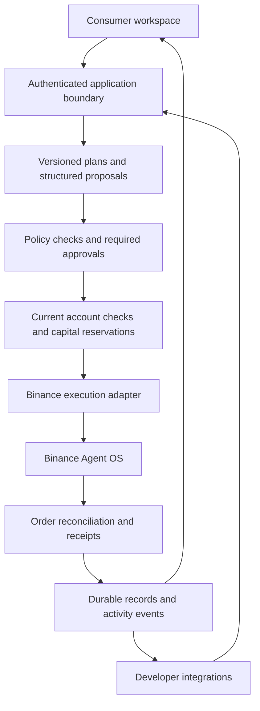

# Virgil

**Trading intentions, coordinated capital, verified outcomes.**

Virgil is a trading workspace and developer platform designed for Binance Agent OS. Its purpose is to turn a user's intention into a clear plan, coordinate that plan with other activity on the account, and follow execution through to a verifiable result.

The product brings two experiences together: an approachable workspace for people who want to delegate trading tasks, and developer tools for those building their own strategies and agents. Both are designed around the same plans, rules, approvals, and execution boundaries.

## Why Virgil?

An individual trade is only part of a larger workflow. Users also need to decide how much capital is available, understand competing orders, approve changes, and verify what actually happened.

Those responsibilities become harder when several strategies share an account. Two agents can each propose a reasonable purchase while collectively committing more money than is available. A network timeout can leave an order's outcome uncertain. A changed plan can make an earlier approval inappropriate.

Virgil's guiding idea is to make that coordination explicit: user intent becomes structured terms, rules determine what is permissible, and execution evidence determines whether the work is complete.

## Who is it for?

### Consumers

Binance users who understand buying and selling crypto but do not want to configure scripts, supervise multiple bots, or reconcile every order themselves.

The consumer experience is designed around:

- Expressing an intention in ordinary language or a guided form.
- Reviewing the amount, account, rules, and consequences before approving.
- Managing persistent plans outside a chat transcript.
- Understanding conflicts and choosing feasible adjustments.
- Seeing completed actions and decisions that need attention.

### Developers and technical users

Builders who want to bring their own strategy logic while using a common foundation for plan validation, permissions, capital coordination, and execution records.

The developer experience is designed for custom applications, trading strategies, and external agents. A proposal from an integration follows the same governing rules as one created in the consumer workspace.

## Example workflows

- **One-time purchase:** Prepare a BTC purchase denominated in USDT, review its terms, and inspect the result.
- **Recurring allocation:** Coordinate scheduled purchases with a user-defined reserve.
- **Shared capital:** Resolve competing requests from a consumer plan and an independent strategy.
- **Plan adjustment:** Offer a smaller purchase or a later execution when the original terms cannot be fulfilled.
- **Execution follow-through:** Reconcile partial fills and uncertain order responses before deciding what happens next.

These workflows describe the product's intended experience. The local examples below exercise the plan and policy domain without placing exchange orders.

## Architecture

Virgil separates intent, permission, and execution. The following diagram describes the system design:



The domain code is organized into separate modules:

| Module | Responsibility |
| --- | --- |
| `src/plans/` | Validated plan terms, source identity references, revisions, review, and approval transitions |
| `src/auth/` | Demo sessions and hashed tokens; actor identity is derived from the session |
| `src/records/` | Transactional persistence for workspaces, accounts, plans, and activity |
| `src/boundary/` | Authenticated workspace operations, account isolation, and revision checks |
| `src/money/` | Exact decimal-string arithmetic for quote amounts |
| `src/http/` | Local HTTP adapter used by the browser workspace |
| `src/policy/` | Deterministic decisions based on mandate rules and supplied risk results |
| `src/risk/` | Position-size and available-capital evaluation using supplied exposure |
| `src/types/` | Shared mandate, proposal, risk-result, and decision schemas |

### Design principles

- **Plans outlive conversations.** Structured terms define the action; text explains the intention.
- **Approval belongs to a revision.** Editing terms returns the plan to draft and removes its previous approval.
- **Hard failures take precedence.** A failed risk check produces a block even when the amount would otherwise require human approval.
- **Evaluation is not execution authority.** Execution must check current permissions, rules, account state, and capital commitments.
- **Money has an explicit denomination.** Plan amounts use decimal strings paired with a quote asset, avoiding conversion to floating-point numbers during validation.
- **Identity references are not credentials.** Authentication and ownership checks belong at the application boundary.
- **Submitted does not mean completed.** Order status and plan status are separate concepts.
- **Governance has a boundary.** Virgil governs its own execution path; independently authorized exchange activity must be reconciled.

The plan lifecycle functions remain pure domain operations. The application boundary authenticates callers and persists results. It is not an exchange execution service.

## Tech stack

| Area | Technology |
| --- | --- |
| Runtime | Node.js 22+ |
| Language | TypeScript 5, strict checking |
| Module configuration | ES modules, ES2022 target, Bundler resolution |
| Runtime validation | Zod 3 |
| Tests | Vitest 2 |
| Frontend | TypeScript, CSS, Vite 5 |
| Browser tests | Playwright |
| Development scripts | tsx 4 |
| Package management | pnpm with a committed lockfile |
| Target exchange integration | Binance Agent OS |

See [package.json](package.json) for dependency ranges and [pnpm-lock.yaml](pnpm-lock.yaml) for resolved versions.

## Getting started

Install Node.js 22+ and pnpm, then:

```sh
git clone https://github.com/yaji33/virgil.git
cd virgil
pnpm install --frozen-lockfile
pnpm dev
```

Open `http://127.0.0.1:5173` to create, review, approve, and revise a plan. The page opens a local demo session with no Binance credentials and places no trades. Plans, activity, and the illustrative USDT balance are saved on this computer and survive refresh. The workspace includes a labelled capital-conflict simulation and labelled snapshot and execution examples.

For the command-line lifecycle example, run `pnpm demo:plans`.

The plan demo creates an integration-sourced purchase, moves it through review and approval, and changes the amount to demonstrate approval invalidation. It requires no Binance credentials.

Run the policy examples separately:

```sh
pnpm demo
```

These demonstrate an allowed purchase, a disallowed asset, a human-approval threshold, and a disallowed product.

### Development commands

| Command | Purpose |
| --- | --- |
| `pnpm dev` | Start the local browser workspace |
| `pnpm preview` | Preview the built frontend on port 4173 |
| `pnpm demo:plans` | Run the local plan lifecycle example |
| `pnpm demo` | Run the deterministic policy examples |
| `pnpm lint` | Check TypeScript without emitting files |
| `pnpm test` | Run the test suite once |
| `pnpm test:watch` | Run tests in watch mode |
| `pnpm build` | Emit the core into `dist/` and bundle the frontend into `web/dist/` |
| `pnpm test:e2e` | Run browser workflow tests |

## Tests

Verified on September 8, 2026, using Node.js 22.20.0:

| Check | Result |
| --- | --- |
| TypeScript check | Passed |
| Plan tests | 19 passed |
| Policy tests | 6 passed |
| Workspace tests | 7 passed |
| Boundary tests | 7 passed |
| HTTP tests | 1 passed |
| Unit total | 40 passed across 5 test files |
| Browser tests | 7 passed in installed Chrome, including a mobile viewport |

The suite covers consumer and integration plan sources, revision-bound approval, approval invalidation, stale revisions, invalid transitions, input-copy behavior, decimal-string validation, asset and product restrictions, position limits, and risk-failure precedence.

Browser tests cover revision and approval, capital-conflict resizing, labelled snapshot and execution examples, validation, escaped user input, keyboard dismissal, reload persistence, and mobile overflow. These tests do not establish live exchange integration or trading performance.

Reproduce the checks with:

```sh
pnpm lint
pnpm test
```

Install the browser once with `pnpm exec playwright install chromium`, then run `pnpm test:e2e`. To use an installed Chrome instead, set `VIRGIL_BROWSER_CHANNEL=chrome` in your shell before running the tests. For PowerShell: `$env:VIRGIL_BROWSER_CHANNEL = 'chrome'`.

## Contributing

Follow [AGENTS.md](AGENTS.md). Keep code self-explanatory, comments concise and useful, and changes focused. Add behavioral tests when changing financial rules or lifecycle transitions.

Product semantics are documented in the [product contract](docs/PRODUCT.md); interaction and visual principles are in the [interface specification](docs/INTERFACE.md).

## License

MIT, as declared in [package.json](package.json).
